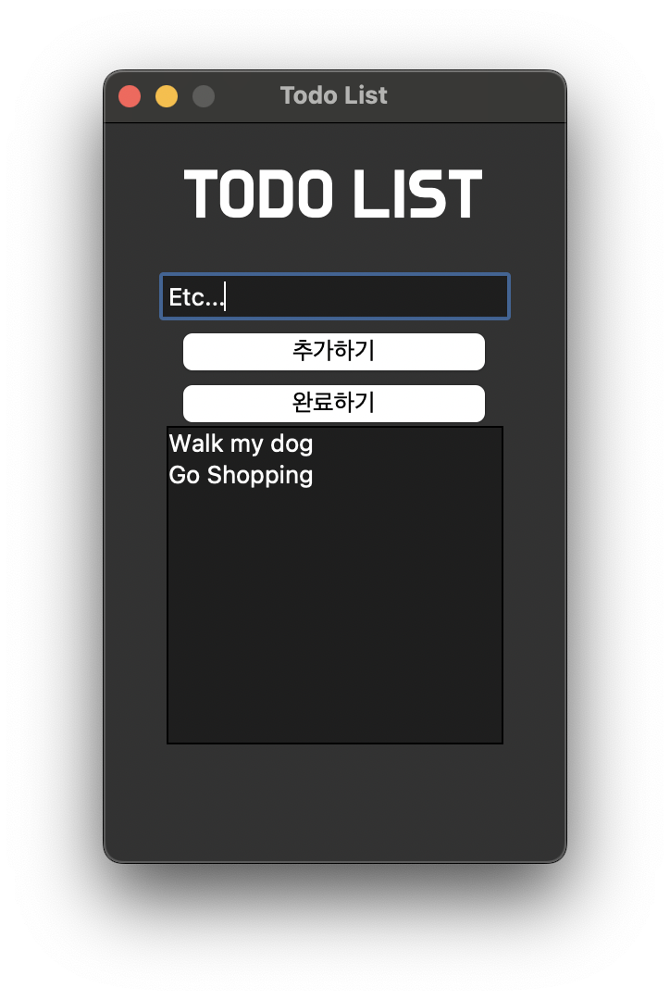

# Python을 사용한 간단한 할 일 관리기
 Python의 Tkinter의 UI를 활용하여 간단한 할 일 관리기를 만들었습니다.  
할 일을 추가한 후 선택하여 삭제가 가능합니다.

# Simple To Do List Using Python
I made an simple to-do list using Tkinter of Python.  
You can add a to-do thing and delete it by selecting it.

